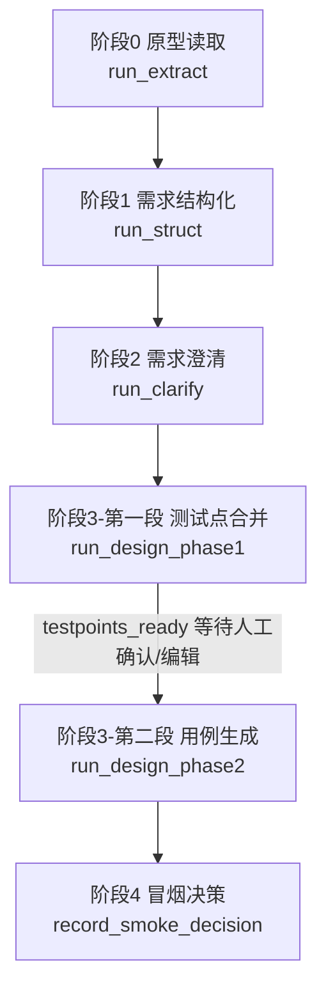
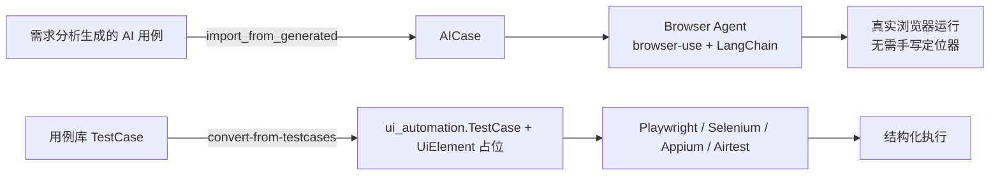
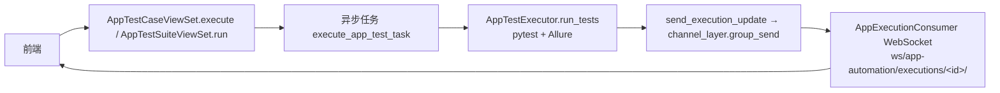
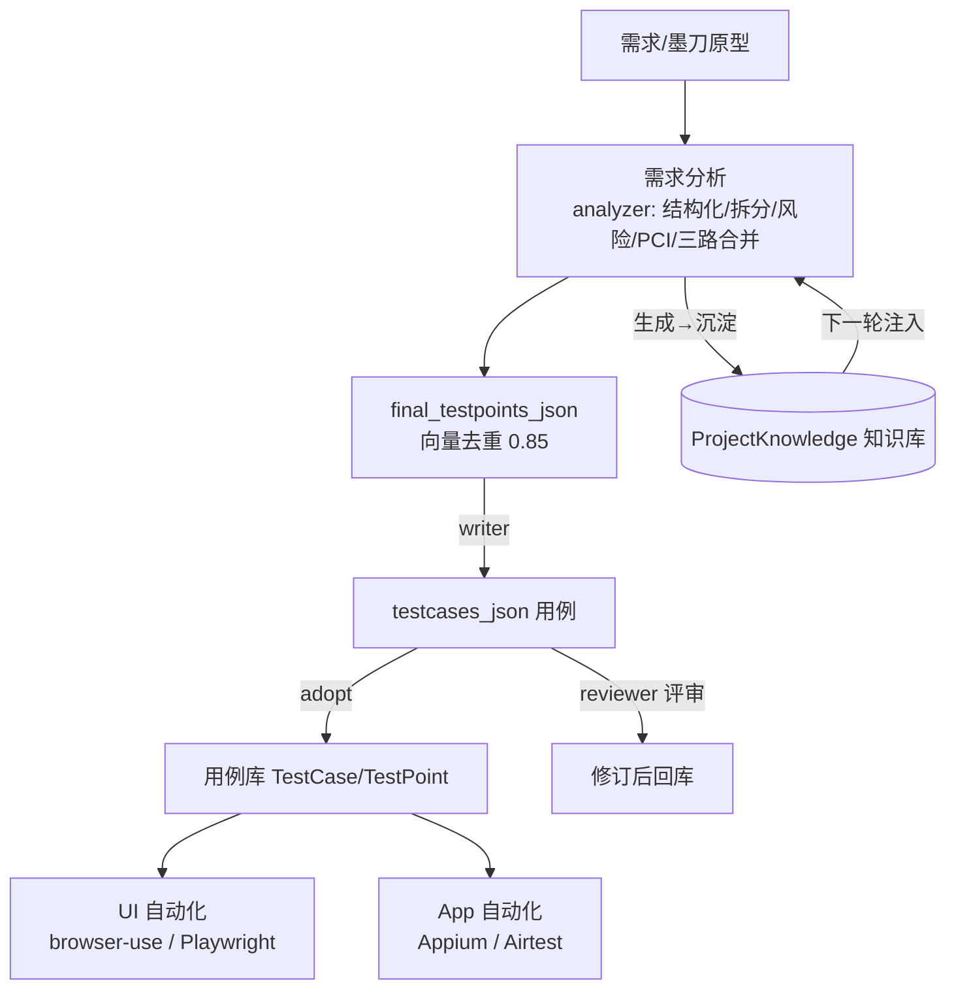

# TestHub 测试工具架构说明

> 目的：帮助新同学 / 维护者快速熟悉 TestHub「AI 驱动测试管理平台」的整体功能、每个功能的流程、所依赖的 AI 模型角色与关键逻辑。
> 阅读完本文应能回答：平台有哪些能力？每条能力从输入到输出经过哪些步骤？调用了哪个 AI 模型？底层模型/知识库是怎么配置的？

---

## 1. 系统概览

| 项 | 说明 |
|----|------|
| 定位 | AI 驱动的全栈测试管理平台：从需求/原型 → 自动生成测试点/用例/冒烟/质量报告 → 一键采纳进用例库 → 驱动 UI/App 自动化执行 |
| 后端 | Django 4.2 + DRF，容器化部署（`testhub-backend`） |
| 前端 | Vue 3（`frontend/`，构建产物 `dist` 由 nginx 容器托管） |
| AI 抽象 | 统一的 `AIModelConfig` 配置表（按 `role` 区分 文本生成 / 向量化 / 视觉），所有 LLM 调用收敛到 `AIModelService` |
| 顶层路由 | 见 `backend/urls.py`，各 app 以 `/api/<app>/` 挂载 |

### 顶层模块地图（`backend/urls.py`）

| 挂载路径 | app | 职责 |
|----------|-----|------|
| `/api/projects/` | projects | 项目、版本、项目知识库（Markdown + DB） |
| `/api/testcases/` | testcases | 用例库、测试用例、执行触发 |
| `/api/testsuites/` | testsuites | 测试套件 |
| `/api/feature-modules/` | feature_modules | 功能模块树、测试点（TestPoint） |
| `/api/executions/` | executions | 执行记录 |
| `/api/reports/` | reports | 测试报告 |
| `/api/reviews/` | reviews | 用例评审 |
| `/api/versions/` | versions | 版本管理 |
| `/api/requirement-analysis/` | requirement_analysis | **核心：需求分析 + 墨刀技能 + AI 用例生成/评审** |
| `/api/ui-automation/` | ui_automation | **UI 自动化：browser-use/Playwright/录制** |
| `/api/app-automation/` | app_automation | **App 自动化：Appium/Airtest** |
| `/api/assistant/` | assistant | AI 对话助手 |
| `/api/core/` | core | 通用能力 |
| `/api/defects/` | defects | 缺陷管理 |
| `/api/data-factory/` | data_factory | 测试数据工厂 |
| `/api/analytics/` | analytics | 行为埋点分析 |
| `/api/` | api_testing | 接口测试 |

---

## 2. AI 模型与基础设施（理解一切的前提）

整个平台的 AI 能力靠 **「一张配置表 + 角色枚举」** 抽象。文本生成与向量化是同一张表的两类角色，各自独立配置 `base_url` / `model_name` / `api_key`。

### 2.1 `AIModelConfig` 模型（`apps/requirement_analysis/models.py`）

字段：`name` / `model_type`(deepseek/qwen/siliconflow/other) / `role` / `api_key` / `base_url` / `model_name` / `max_tokens` / `temperature` / `top_p` / `is_active`。

`role` 枚举及在流程中的承担：

| role | 显示名 | 承担 |
|------|--------|------|
| `analyzer` | 需求拆解专家 | 需求结构化、模块拆分、风险/PCI/三路合并/质量自检的 LLM 生成 |
| `writer` | 测试用例编写专家 | 测试用例文本生成、评审后改进 |
| `writer_vision` | 视觉分析专家 | 截图/图片/表格型页面的 OCR 与多模态识别 |
| `reviewer` | 测试评审专家 | 测试用例评审 |
| `browser_use_text` | Browser Use 文本模式 | UI 智能执行的 Agent 模型 |
| `embedder` | 向量化模型 | 三路合并语义去重的向量化（如 bge-m3） |

> 约定：每个 role 只允许一个 `is_active=True`。`analyzer` 缺失时 fallback 复用 `writer`（都是文本生成 LLM）。

### 2.2 `AIModelService` 两大能力（`apps/requirement_analysis/models.py`）

| 能力 | 方法 | 调用终点 | 批处理 | 用途 |
|------|------|----------|--------|------|
| 文本生成 | `call_openai_compatible_api(config, messages, max_tokens)` | `/v1/chat/completions` | 无（整批 messages 一次发） | analyzer / writer / reviewer / vision |
| 向量化 | `embed_texts(config, texts)` | `/v1/embeddings` | **有，`BATCH_SIZE=10` 切片**（dashscope 兼容接口单次最多约 10 条，超量 400） | embedder |

- 文本生成超时：`connect=60, read=900`（支持大文档）；流式变体 `call_openai_compatible_api_stream` 支持截断自动续写（最多 5 次）。
- 向量化返回维度取决于所配模型（实测 1024 维）。

### 2.3 知识库机制（`apps/projects/models.py` + `AIModelService`）

双源合并，参与每一次生成：

1. **文件系统 Markdown 知识库**：`Project.knowledge_base_path` 指向目录，递归读取所有 `.md`（≤2 层）拼成 `【项目业务知识库】` 上下文。
2. **数据库条目**：`ProjectKnowledge` 表（title/category/content…）。
3. `build_knowledge_context_from_project(project)` **合并两源**，保证「自适应回填的新知识」下次生成可复用。
4. 墨刀工作流通过 `_kb_suffix()` 在阶段1/3 的 prompt 末尾注入 `### 项目知识库参考`；无知识库时降级为空串，不阻塞。
5. **生成→沉淀→再生成闭环**：`auto_fill_knowledge_from_confirmations` / `auto_fill_knowledge_from_modao_products` 把本次产物（澄清/风险/PCI/质量缺口）提炼回写 `ProjectKnowledge`。

### 2.4 语义去重的实际实现（重要澄清）

> ⚠️ **当前生产流程是「实时 `embed_texts` + numpy 余弦相似度」，Chroma 持久集合未被真正使用。**

- 真实路径：`ModaoWorkflow._vector_dedup(items)`（`modao_workflow.py`）——取 `description||title` → `embed_texts` 向量化 → L2 归一化后 `sim = arr @ arr.T` → `sim[i][j] >= 0.85` 判为近重复，合并 `source` 并保留高优先级（P0>P1>P2）代表。
- `vector_store.py`（Chroma 封装：`get_merge_collection`/`upsert_requirements`/`query_near_duplicates`）目前**仅被 import**，去重未走它；`release_merge_collection` 是安全空操作。即该文件是「方案 A 的预留层」，写文档时不要误以为已用 Chroma。
- 降级：无 embedder 或向量化异常时直接 `return items, 0`（跳过语义去重）。

### 2.5 统一项目体系

- `GET /api/ui-automation/all-projects/`（`get_all_projects_unified`）：合并 UI 自动化项目（`source='ui'`）+ 需求分析 AI 项目（`source='proj'`），供所有项目下拉框。
- `POST /api/ui-automation/ensure-ui-project/`（`ensure_ui_project`）：传入 AI 项目 id，自动创建/复用对应 `UiProject`，打通「AI 项目 ↔ UI 自动化项目」归属。

---

## 3. 功能一：需求分析 / 墨刀原型 → 用例设计（墨刀技能）

承载模型 `ModaoPrototype`（`apps/requirement_analysis/models.py`），编排类 `ModaoWorkflow`（`modao_workflow.py`）。

### 3.1 五阶段总览

状态流转：`extracting→extracted→structuring→clarifying→designing→testpoints_ready→done`。

### 3.2 各阶段流程 / 模型角色 / 关键逻辑

| 阶段 | 入口方法 | 用的角色 | Prompt 常量 | 输入 → 输出字段 |
|------|----------|----------|-------------|------------------|
| 0 读取 | `run_extract` | —（Playwright 抓取） | — | 墨刀/webshare 链接 → `extracted_json` / `ModaoPage` |
| 1 结构化 | `run_struct` | analyzer | `P0_REQUIREMENT_STRUCT` | `_source_text()` → `requirement_summary`(YAML) |
| 2 澄清 | `run_clarify` | analyzer | （内联 JSON 约束） | `requirement_summary` → `clarification_log` |
| 3.1 模块拆分 | `run_design_phase1` 内 | analyzer | `P1_MODULE_SPLIT` | `requirement_summary` → `module_split` |
| 3.2 基础测试点 | 同上 | analyzer | `P2_TESTPOINT_GEN` | 每模块 → `draft_tps`(source=['draft']) |
| 3.3.5 风险 | 同上 | analyzer | `P5_RISK_IDENTIFY` | draft → `risks_json`，扩展点 source=['risk'] |
| 3.3.6 PCI | 同上 | analyzer | `P6_PCI_IDENTIFY` | draft → `pci_json` |
| 3.3.7 三路合并去重 | 同上 | analyzer(EMBED) | `P7_MERGE_DEDUP` | 合并 → `final_testpoints_json` |
| 3.4 用例生成 | `run_design_phase2` | **writer** | `P3_CASE_GEN` | 测试点 → `testcases_json` |
| 3.5 冒烟 | 同上 | analyzer | `P4_SMOKE_EXTRACT` | 测试点 → `smoke_json`（注意用 YAML 解析） |
| 3.6 质量自检 | 同上 | analyzer | `P8_QUALITY_CHECK` | 用例 → `quality_report_json` |
| 3.7 Excel | 同上 | — | — | openpyxl 导出 `excel_path` |

### 3.3 三路合并去重详解（本平台最核心的增强逻辑）

"三路"= A 墨刀 AI 提取(draft) / B 已有文档 / C 手工补充。在阶段3.3.7 实际落地为：

1. **向量去重**：每模块 `combined = draft_tps + risk_ext` → `_vector_dedup(combined)`（阈值 0.85，保留高优先级、合并 source）。
2. **P7 逻辑层合并**：`P7_MERGE_DEDUP` 再定义 D1 完全相同 / D2 标点空白差异 / D3 同源同类三类规则，做优先级裁决（P0 不可下调、风险 high 上调、PCI blocker 标 `blocked`）、约束 P0 占比 ≤15%、`description ≥80` 字。
3. **全局二次去重（2026-07-22 新增）**：phase1 末尾按 `module` 分组再跑一遍 `_vector_dedup`，**仅消同模块内近重复**，避免跨模块同功能（如多个"登录"）被误删。

> 增强能力边界：风险识别（R1~R5 五类，须关联 `related_testpoints` 并扩展 `extended_test_points`）、PCI 识别（Q1~Q5 五类，须标 `blocked_scenarios`/`resolution_condition`/`impact`，并合并 stage2 已识别问题）、质量自检（C1~C6 门禁，C1/C2/C3 阻断，C4/C5/C6 警告）。

### 3.4 API 与前端

完整前缀：`/api/requirement-analysis/api/modao/`（app 挂载 `api/requirement-analysis`，内部再带 `api/`，注意**双 api 前缀**）。

| 接口 | 说明 |
|------|------|
| `POST /create/` | 创建需求来源（墨刀链接 / 文本） |
| `GET /list/` | 历史列表 |
| `POST /<pk>/extract/` `/struct/` `/clarify/` | 阶段0/1/2 |
| `POST /<pk>/design/` | 阶段3 第一段（测试点合并，等待确认） |
| `POST /<pk>/generate-cases/` | 阶段3 第二段（用例→冒烟→质量→Excel） |
| `POST /<pk>/confirm/` | 确认：同步功能模块体系 + 回填知识库 |
| `POST /<pk>/smoke/` | 阶段4 冒烟决策 |
| `PATCH /<pk>/edit/` | 保存人工编辑（字段白名单） |
| `POST /<pk>/ask/` | 阶段答疑（analyzer/writer） |
| `GET,DELETE /<pk>/` | 查询 / 删除 |
| `GET /<pk>/excel/` | 下载 Excel |
| `POST /<pk>/adopt/` `/adopt-single/` | 一键 / 逐条采纳用例到用例库（按 项目+标题+子模块 幂等） |

前端：
- `frontend/src/views/requirement-analysis/ModaoSkillView.vue`：墨刀技能 5 阶段引导式主界面（94.7KB）。
- `RequirementAnalysisView.vue`：另一套 `req-docs / testcase-generation / analysis-results` 需求拆解流程（与墨刀技能并列）。
- API：`frontend/src/api/requirement-analysis.js`。

---

## 4. 功能二：AI 用例生成与评审（通用流程）

`requirement_analysis` 除墨刀技能外，还提供「需求文档 → 用例」通用生成与评审闭环（对应 `RequirementAnalysisView.vue`）。

| 环节 | 调用角色 | 方法 | 说明 |
|------|----------|------|------|
| 需求拆解 | analyzer（缺失回退 writer） | `call_openai_compatible_api` | 结构化需求 → 测试点 |
| 用例生成 | **writer** | `AIModelService.generate_test_cases` | 测试点 → 测试用例（注入知识库上下文 `build_knowledge_context`） |
| 用例评审 | **reviewer** | `AIModelService.review_test_cases` | 产出 C1~C6 类评审结论 |
| 评审后改进 | writer | `revise_test_cases_based_on_review` | 按评审意见修订 |
| 知识库回填 | — | `auto_fill_knowledge_from_confirmations` | 用户确认的问答 → `ProjectKnowledge` |

---

## 5. 功能三：UI 自动化执行（`ui_automation`）

前缀 `/api/ui-automation/`。核心模型：`UiProject` / `UiTestCase` / `UiElement` / `AICase` / `AIExecutionRecord` / `AppDevice` / `AppConfig` 等。

### 5.1 两条执行路径

- **AI 用例路径**：`AICaseViewSet.run` 创建 `AIExecutionRecord` 并异步启动 `BrowserAgent`（`ai_base.py`/`ai_agent.py`，默认 `role_name='browser_use_text'`），由 `browser_use.Agent` 驱动真实浏览器，**无需定位器**。
- **结构化用例路径**：`TestCaseViewSet.convert-from-testcases` 把用例库 `TestCase` 转成 `ui_automation.TestCase`（含 `UiElement` 占位、自动推断 `action_type`），由 `PlaywrightTestEngine`（`playwright_engine.py`）或 `selenium_engine`/`appium_engine`/`airtest_engine` 驱动。
- **录制 / 导入**：`recording/start|page|action|stop|generate` 五个端点录制操作；`airtest/import/` 导入 Airtest 脚本生成用例。

### 5.2 模型角色

UI 模块**自身不直接生成用例文本**，只消费 `requirement_analysis` 的结果；执行侧取 `browser_use_text` 角色（`AIIntelligentModeConfigViewSet` / `views_config.py`）。调用统一走 `AIModelService.call_openai_compatible_api`。

### 5.3 主要 API（ViewSet 注册）

`dashboard` / `projects` / `elements` / `element-groups` / `test-scripts` / `page-objects` / `test-suites` / `test-executions` / `screenshots` / `test-cases` / `test-case-executions` / `scheduled-tasks` / `ai-cases` / `ai-execution-records` / `app-devices` / `app-configs` / `config/environment` / `config/ai-mode` / `ai-models`；
函数视图：`all-projects/` / `ensure-ui-project/` / `learn-elements/` / `save-knowledge/` / `recording/*` / `airtest/import/`。

---

## 6. 功能四：App 自动化执行（`app_automation`）

前缀 `/api/app-automation/`。与 `ui_automation` 共享 `AppDevice` / `AppConfig` 模型；本模块另有 `AppProject` / `AppTestCase` / `AppTestExecution` 等。

### 6.1 引擎与能力

- **Appium 引擎**：驱动真机/模拟器（Android/iOS），支持 click/input/swipe/scroll/launch_app，定位策略 id / accessibility_id / xpath / uiautomator / ios_predicate / class_chain。
- **Airtest 引擎**：`utils/airtest_base.py`（`AirtestBase`）+ `runners/ui_flow_runner.py`，Android 走 `adb getevent` 触摸监听，iOS 复用 WDA（`AppDevice.appium_server_url`）。
- **录制 / 远程手机**：沿用 `ui_automation` 的 `recording/*` 端点；设备经 `DeviceManager`（`managers/device_manager.py`，Android ADB，支持远程 `-H/-P`，默认端口 5037）管理。

### 6.2 执行链路

- `executors/test_executor.py`（`AppTestExecutor`）：封装 **pytest + Allure**，构造环境变量后子进程跑 pytest，产出 Allure 报告。
- `consumers.py` + `routing.py`：`AppExecutionConsumer`（AsyncJsonWebsocketConsumer）按 `execution_id` 加入分组，**实时推送执行进度/状态/日志/报告路径**给前端。

### 6.3 模型角色

App 自动化模块**本身不调用任何 LLM**（执行侧只消费 `requirement_analysis` 生成的 `AICase` 或用例库结果，负责执行与报告）。

### 6.4 主要 API

ViewSet：`projects` / `config` / `dashboard` / `devices` / `elements` / `components` / `custom-components` / `component-packages` / `packages` / `test-cases` / `test-suites` / `scheduled-tasks` / `notification-logs` / `executions`；
函数视图：`executions/<id>/report/`、`executions/<id>/report/<path>/`（服务 Allure 报告文件）。

---

## 7. 端到端数据流总图

---

## 8. 关键约定与踩坑（维护必读）

1. **双 api 前缀**：墨刀接口完整路径是 `/api/requirement-analysis/api/modao/...`（app 挂载 `api/requirement-analysis`，内部又带 `api/`）。前端 `base()` 也拼了一次 `api/`。
2. **Chroma 未真正启用**：去重走实时 `embed_texts` + numpy，`vector_store.py` 是预留层，不要误以为已用 Chroma 持久集合。
3. **embedder 分批**：`embed_texts` 必须按 ≤10 条/批切片（dashscope 兼容接口单次上限约 10 条，超量 400 会被 `_embed` 捕获导致去重被静默跳过）。
4. **容器代码需 `docker cp`**：后端代码打进镜像，`docker restart` 不会加载宿主机改动。改后须 `docker cp <host>/apps/.../<file>.py testhub-backend:/app/apps/.../<file>.py` 再 `docker restart testhub-backend`。
5. **前端 dist 缓存**：部署前端前先 `npm run build`，再 `docker compose build --no-cache frontend`，浏览器 Ctrl+F5 硬刷新。
6. **冒烟解析用 YAML**：`P4_SMOKE_EXTRACT` 输出必须用 `_parse_yaml` 解析，用 JSON 会失败。
7. **状态幂等**：采纳用例按 `(项目, 标题, 子模块)` 去重，重复采纳不重复入库。

---

## 9. 快速索引（关键文件 / 符号）

| 想要看 | 去这里 |
|--------|--------|
| 墨刀工作流编排 | `apps/requirement_analysis/modao_workflow.py`（`ModaoWorkflow`） |
| 各阶段 Prompt | `apps/requirement_analysis/modao_prompts.py` + `modao_skill/prompts/` |
| 模型配置 / 服务 | `apps/requirement_analysis/models.py`（`AIModelConfig` / `AIModelService`） |
| 知识库 | `apps/projects/models.py`（`ProjectKnowledge`）+ `models.py:build_knowledge_context_from_project` |
| 向量去重 | `apps/requirement_analysis/modao_workflow.py:_vector_dedup` / `_embed` |
| 墨刀 API | `apps/requirement_analysis/modao_views.py` + `urls.py` |
| UI 执行 Agent | `apps/ui_automation/ai_agent.py` / `ai_base.py` / `playwright_engine.py` |
| App 执行 | `apps/app_automation/executors/test_executor.py` / `managers/device_manager.py` / `consumers.py` |
| 前端主界面 | `frontend/src/views/requirement-analysis/ModaoSkillView.vue` |
| 前端 API | `frontend/src/api/requirement-analysis.js` |
